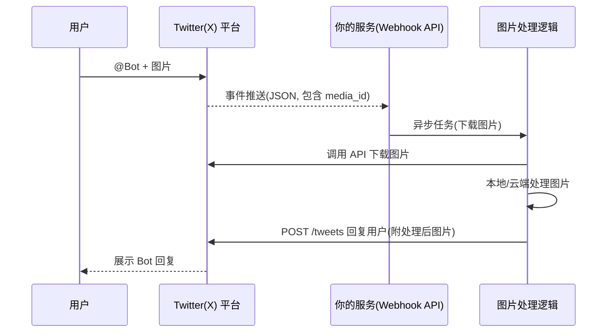
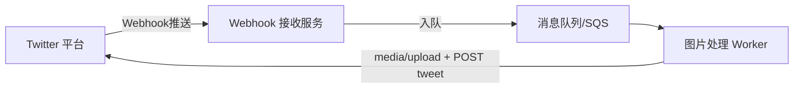

+++
title = "Twitterbot"
date = 2025-08-15T10:32:44+08:00
draft = false
description = ""
subtitle = ""
header_img = ""
short = false
toc = true
tags = []
categories = []
series = []
comment = false
summary = ""
hidden = false
+++

# Twitter（X）Bot 开发与运营指南

本文档汇总了 Twitter Bot（现 X Bot）在业务设计、API 选择、权限计划、架构实现等方面的关键知识点，结合图片处理与自动回复场景进行说明。

---

## 1. 基础概念

**Twitter Bot** 是通过 Twitter API（现 X API）与用户进行自动化交互的程序，可以处理用户发送的内容，并执行自动回复、数据分析等操作。

* **典型场景**：客服机器人、图片处理与回复、信息推送、内容监控。
* **底层依赖**：X API（v2 为主，部分功能需 v1.1）。

---

## 2. Bot 工作流程示例（被 @ 发图片 → 回复）



---

## 3. 核心技术环节

### 3.1 事件接收

* **推荐**：Account Activity API（Webhook 推送，Premium/Enterprise/Basic+ 支持）。
* **替代方案**：轮询 `/2/tweets/search/recent` 接口（延迟高、占用读额度）。

事件数据包含：

* 用户信息（user\_id, screen\_name）
* 推文文本
* 媒体对象（`media_keys` / `media_url`）

### 3.2 媒体获取与上传

* **下载**：通过媒体 ID 调用 GET `/2/media/:id`（OAuth 2.0 Bearer Token）。
* **上传**：`POST media/upload`（v1.1 API），返回 `media_id`，用于发推时附加。

### 3.3 回复用户

* 回复推文：

  ```json
  {
    "text": "处理好了！",
    "in_reply_to_tweet_id": "<原推ID>",
    "media": {
      "media_ids": ["<media_id>"]
    }
  }
  ```
* 私信回复：使用 Direct Message API（v1.1），需额外权限。

---

## 4. 调用与路由机制

* **Webhook 路由**：事件触发 → 服务解析 JSON → 根据业务逻辑调用不同 API 端点。
* **域名解析**：X API 默认依赖 HTTPS 域名访问，无需自建 DNS。

---

## 5. 开发者账号与权限计划

### 5.1 账号类型

| 类型   | 特点            | 适用场景            |
| ---- | ------------- | --------------- |
| 个人账号 | 个人名义注册，审核相对简单 | 个人开发、POC、轻量 Bot |
| 企业账号 | 企业名义注册，可做品牌认证 | 客服、品牌运营、商业合作    |

### 5.2 API 访问计划

| 计划         | 月费      | 写推文额度    | 特点                   |
| ---------- | ------- | -------- | -------------------- |
| Free       | \$0     | 1500 条   | 测试/低频使用，轮询获取事件       |
| Basic      | \$100   | 50,000 条 | 支持 Webhook、足够中小型 Bot |
| Pro        | \$5,000 | 更高额度     | 中大型商用                |
| Enterprise | 定制      | 定制       | 全功能+专属支持             |

---

## 6. 不同场景下的选择建议

* **开发测试阶段**：

  * 用个人账号 + Free Plan。
  * 少量真实调用，其他用 mock 数据。
* **正式运行（你当前的业务场景）**：

  * 每天 \~2000 次交互，QPS ≤ 10。
  * **个人账号 + Basic Plan** 足够。
* **需要品牌形象/客服**：

  * 用企业账号 + Basic/Pro。

---

## 7. 速率限制与时效性

* **Free Plan**：推文写入 1500 条/月，读请求额度很小，不适合持续运营。
* **Basic Plan**：写 50,000 条/月，读 10,000 条/月，足够日常运营。
* **长耗时处理**：

  * Webhook 接收事件后立即返回 200，处理逻辑放到异步任务。
  * 回复没有时间硬限制（可延迟数分钟或更久）。
  * media\_id 最好上传后立即使用。

---

## 8. 架构建议（长耗时 Bot）



优点：

* Webhook 响应快，不会超时。
* 异步处理可容忍长耗时任务（>10 分钟）。
* 扩展性好，可水平扩展 Worker。

---

## 9. 注意事项

* 防止 Bot 回复自己造成循环触发。
* 控制速率，避免触发 API 限流。
* 媒体上传有大小限制（图片 ≤5MB）。
* 按政策在 Bot 简介中说明自动化性质。
* 企业 Bot 处理私信/用户数据时需隐私政策链接。

---

## 10. 参考链接

* 开发者平台：[https://developer.x.com](https://developer.x.com)
* API 文档（v2）：[https://developer.x.com/en/docs/x-api](https://developer.x.com/en/docs/x-api)
* 自动化规则：[https://help.twitter.com/en/rules-and-policies/twitter-automation](https://help.twitter.com/en/rules-and-policies/twitter-automation)
* Tweepy（Python SDK）：[https://docs.tweepy.org](https://docs.tweepy.org)
* twitter-api-v2（Node.js SDK）：[https://github.com/PLhery/node-twitter-api-v2](https://github.com/PLhery/node-twitter-api-v2)

